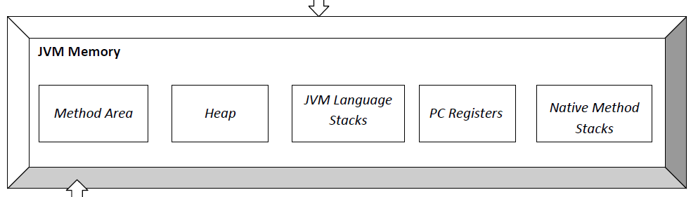

### Java 가 실행되는 과정 정리

`C/C++` 의 경우, 소스코드가 실행되기 위해선 컴파일, 어셈블 과정 등이 필요하다. 그런데 `Java` 에서는 어떻게 돌아가는지 몰랐어서 이를 찾아서 정리했다.

---

아래 그림은 전체 동작이 어떻게 이뤄지는지 간단히 나타낸 그림이다.

<p align="center">
    
</p>

먼저 `JVM` 에 대한 설명이 필요할 듯 하다.
`JVM` 은 `Java Virtual Machine` 의 준말로, 하드웨어 플랫폼에 관계없이 `Java Bytecode` 를 실행할 수 있게 해주는 가상머신이다. `[1]` `JVM` 의 간략한 구조는 다음 그림과 같다. [`[2]`](#java-virtual-machine---wikipedia)

<p align="center">
    
</p>

---

#### 1. Source code to class file

<p align="center">
    
</p>

우리가 작성한 소스코드 `(.java)` 를 실행하기 위해선 먼저 코드를 `class file` `(.class)` 로 변환해야 한다.

이 때 `class file` 이란 `Java Bytecode` 를 포함하는 파일로서, 바이트 코드 외 `"추가적인 정보"` 가 포함된 이진 파일 `(binary file)` 이다. `[3]`
- 여기서 추가적인 정보란 코드 내 생성한 `class` 에 대한 메타데이터, 정보 등을 말한다.
- 클래스의 이름, 메서드, 구현된 인터페이스, 상수 풀 등이 포함되어 있다.
- 이진 파일이기에 그대로 볼 수 없지만 아래 명령어를 이용해 직접 볼 수 있다.

```bash
$ java ${SourCode}.java && javap -c ${ClassName}.class
```

소스코드는 자바 컴파일러 `(javac)` 를 통해 클래스 파일로 변환되고, 클래스 파일은 `JVM` 으로 넘겨진다.

덧붙여 클래스 파일과 `Bytecode` 는 하드웨어 플랫폼과 독립적이다. 이러한 이유 때문에 `Java` 의 표어는 `"한번 쓰고 어디서든 실행하세요"` `(WORA, Write Once, Run Anywhere)` 이다. [`[4]`](#write-once-run-anywhere)

---

#### 2. `JVM` - Class file to Bytecode

<p align="center">
    
</p>

프로그램을 실행시키기 위해선, 우리가 작성한 코드 `(명령어)` 를 메모리에 올려야 한다. 

`Java` 는 클래스 파일을 `JVM` 내 `Runtime Data Area` 에 올리는 방식으로 구현한다.

우리가 변환한 클래스 파일은 `JVM` 의 `Class loader` 를 통해 `Runtime Data Area` 에 적재된다. `(Class loader 에 대한 설명은 생략한다.)` 이 때의 특징은 `"동적으로 적재된다"` 는 것이다.
- `C/C++` 를 예로 들어 생각해보자. `C/C++` 에서 메모리 할당 또는 해제는 전적으로 개발자의 묷이다. `(malloc, free, new, delete)`
- 하지만 `Java` 의 경우 `JVM` 이 이를 맡게된다. 새로운 메모리 할당은 물론, 메모리 해제 또한 자동으로 이뤄진다.
- 더 자세히 말하자면 `Runtime Data Area` 는 또다시 여러 부분으로 나뉘는데, 이 중 `Heap` 영역이 존재한다. 만약 어떤 객체가 `Heap` 영역에서 참조되지 않았다면, 이는 `Garbage collection` 의 대상이 되고, `"언젠가는"` `Garbage collection` 에 의해 메모리가 해제된다.

- `JVM memory overview` : [`[2]`](#java-virtual-machine---wikipedia)
<p align="center">
    
</p>


`Runtime Data Area` 에 클래스 파일이 적재되면, `JVM` 은 클래스 파일 내 `Bytecode` 를 `Execution engine` 으로 전달한다.

---

### 3. Bytecode to machine code

<p align="center">
    
</p>

`Execution engine` 은 `Bytecode` 를 기계어 `(Machine code)` 로 변환한다. 이 때, `Execution engine` 은 `Interpreter` 를 쓰기도 하고, `Compiler` 를 사용하기도 한다. [`[5]`](#jit-vs-interpreters---stackoverflow)
- 어느 `Bytecode` 가 처음 실행될 때는 `Interpreter` 를 통해 기계어로 번역된다.
- 하지만 어느 `Bytecode` 가 여러번 수행 될 시, `JVM` 은 해당 `Bytecode` 를 `Native code` 로 바꿔 `Native method stack` 에 저장한다. 
- 이제 해당 `Bytecode` 가 수행될 때, `Interpreter` 말고 `JIT comipler` 를 사용해 기계어로 번역한다.

이렇게 기계어로 번역된 코드는 이제 하드웨어에 맞춰 실행된다.

---

### Reference

- ##### [`Java virtual machine - Wikipedia`](https://en.wikipedia.org/wiki/Java_virtual_machine)
    - `[1]` : A Java virtual machine (JVM) is a virtual machine that enables a computer to run Java programs as well as programs written in other languages that are also compiled to Java bytecode.
    - `[2]`, [`link`](https://en.wikipedia.org/wiki/Java_virtual_machine#/media/File:JvmSpec7.png) : Overview of a Java virtual machine (JVM) architecture based on The Java Virtual Machine Specification Java SE 7 Edition

- ##### [`Is .class file byte code? or Does .class file include bytecode? - stackoverflow`](https://stackoverflow.com/questions/54605514/is-class-file-byte-code-or-does-class-file-include-bytecode)
    - `[3]` : A Java class file is usually produced by a Java compiler from Java programming language source files (.java files) containing Java classes (alternatively, other JVM languages can also be used to create class files).

- ##### [`Write once, run anywhere - Wikipedia`](https://en.wikipedia.org/wiki/Write_once,_run_anywhere)
    - `[4]` : Write once, run anywhere (WORA), or sometimes Write once, run everywhere (WORE), was a 1995 slogan created by Sun Microsystems to illustrate the cross-platform benefits of the Java language.


- ##### [`JIT vs interpreters - stackoverflow`](https://stackoverflow.com/questions/3718024/jit-vs-interpreters)
    - `[5]` : The difference is in how they generate the native code, how optimized it is as well how costly the optimization is. 
