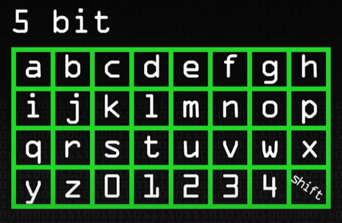
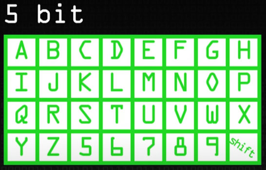

### Chapter 04 : 정보를 어디에 넣고 싶은데

- [`1. 자바에서는 네 가지의 변수가 존재해요`](./section_01.md)
- [`2. 예제를 통해서 지역 변수를 확실히 익히자`](./section_02_05.md)
- [`5. 기본 자료형은 8 개에요`](./section_02_05.md)

### What I learned from this chapter

이번 챕터에서 ~~드디어~~ `Java` 의 자료형에 대한 설명이 나왔다. 지금까지 추가로 검색하며 공부했어서 크게 어렵거나 한 내용은 없었다.

다만 가끔씩 `C++` 과 다른 부분이 있어, 그러한 부분을 정확히 알아보고 기록하는데 시간이 더 걸렸다.

---

\+ 챕터 4 의 `정리해 봅시다` 를 보던 중 `byte 는 왜 만들었을까요?` 라는 질문을 보았다. 그런데 가만히 생각해보니 `"왜 1 byte 는 8 bit 지?"` 라는 질문에 대답할 수 없었다. 그래서 이를 찾아보니 꽤 재미있는 사실을 발견했다.

`(아래 내용은 틀릴 수 있다)`

엄밀히 따지면 `"원래" 1 byte 의 크기는 정해지지 않았` 었다. 최초의 컴퓨터인 `EDSAC` 은 `Baudot code` 를 사용하였고, 이는 `5-bit byte` 였다. 알파벳 `(대, 소문자 26 개)` 과 숫자 `(10 개)` 를 표기하기 위함이었다. `(shift character 를 사용해 모두 표기할 수 있다)`

|`shift off`|`shift on`|
|:---:|:---:|
|||

그 후 `IBM` 에서 `6-bit byte` 인 제품을 출시 하였지만, 곧 `8-bit byte` 제품을 주력으로 출시했다.

`6-bit byte` 와 `8-bit byte` 서로 다른 장점이 존재했다. `6-bit byte` 는 계산 과학용 컴퓨팅 `(scientific computing)` 에 유리하다는 것이고, `8-bit byte` 는 범용 컴퓨팅 `(commercial computing)` 에 유리하다는 점이다. [`[2]`](#julia-evans-some-possible-reasons-for-8-bit-bytes)

하지만 그 때 당시 `BCD` `(Binary-Coded Decimal)` [`[3]`](#3--binary-coded-decimal---wikepedia) 이 유행하였고, 무엇보다 `8-bit byte` 는 `2 의 제곱승` 이라는 점 때문에 `8-bit byte` 제품을 출시하였다. 

---

원래 `1 byte = 8 bit` 인 줄 알았었는데, 사실 이렇게 정의된 것이 아니라 `"통상적으로 여겨진다"` 는 사실을 몰랐었다.
그래서 더 놀라웠고 이야기가 재밌게 느껴진 것 같다.

---

### Reference

- ##### [`[1] : Baudot code - Wikepedia`](https://en.wikipedia.org/wiki/Baudot_code)
- ##### [`Julia Evans, Some possible reasons for 8-bit bytes`](https://jvns.ca/blog/2023/03/06/possible-reasons-8-bit-bytes/#why-was-BCD-popular?)
    - `[2]` : `why was the 6-bit byte better for scientific computing?`
- ##### [`[3] : Binary-coded decimal - Wikepedia`](https://en.wikipedia.org/wiki/Binary-coded_decimal)
- ##### [`Mythical Man Month - Computerphile`](https://www.youtube.com/watch?v=vuScajG_FuI&t=184s)
- ##### [`Brooks on the System 360 and adoption of the 8 bit byte`](https://www.youtube.com/watch?v=9oOCrAePJMs&t=140s)

