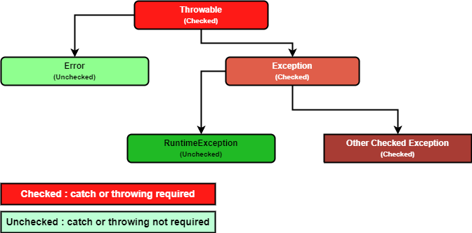

### Chapter 14 : 다 배운 것 같지만, 예외라는 중요한 것이 있어요

- [`7. 모든 예외의 할아버지는 java.lang.Throwable 클래스다`](#7-모든-예외의-할아버지는-javalangthrowable-클래스다)
- [`8. 난 예외를 던질 거니까 throws 라고 써 놓을께`](#8-난-예외를-던질-거니까-throws-라고-써-놓을께)
- [`9. 내가 예외를 만들 수도 있다구?`](#9-내가-예외를-만들-수도-있다구)

---

### `7. 모든 예외의 할아버지는 java.lang.Throwable 클래스다`


<p align="center">
    
</p>

위 그림을 보면 `Exception` 과 `Error` 는 모두 `Throwable` 의 자식인 것을 볼 수 있다. `(그리고 당연히 java.lang.Object 의 자식들 이다)` 

그래서 `Exception` 이나 `Error` 를 `try-catch` 할 때 `Throwable` 을 이용해 처리할 수도 있다.

상속 관계가 이렇게 되어 있는 이유는, `Exception` 이나 `Error` 의 성격은 다르지만 모두 동일한 이름의 메서드를 사용하기 위함이다.

먼저 `Throwable` 의 생성자가 어떻게 생겼는지 알아보자.

|`Constructor`|`Description`|
|---|---|
|`Throwable()`|빈 메세지의 `Throwable` 객체를 생성|
|`Throwable(String message)`|주어진 메세지를 가진 `Throwable` 객체를 생성|
|`Throwable(String message, Throwable cause)`|주어진 메세지와 예외의 원인은 가진 `Throwable` 객체를 생성|
|`Throwable(Throwable cause)`|주어진 예외의 원인과 메세지 `(cause == null ? null : cause.toString())` 을 가진 `Throwable` 객체를 생성|

다음은 `Throwable` 의 메서드 중 3 가지이다.

|`Method`|`Description`|
|---|---|
|`String getMessage()`|현 객체에 저장된 에러 메시지를 반환한다.|
|`String toString()`|현 객체의 `class` 와 저장된 에러 메시지를 포함하는 `String` 을 반환한다.|
|`void printStackTrace()`|`에러 스트림` 에 `toString()` 메서드와 예외가 발생하기 까지의 `호출 관계` `(stack trace)` 를 출력한다.|

다음 예시는 `printStackTrace` 메서드에 관한 예시이다.

```java
class SomeClass {
    static void method_1(int[] array)   {method_2(array);}
    static void method_2(int[] array)   {
        try                     {method_3(array);}
        catch(Exception e)      {e.printStackTrace();}
    }
    static void method_3(int[] array)   {System.out.println(array[0]);}

    public static void main(String[] args) {
        method_1(null);
        System.out.println("End of main");
    }
}
```
```
java.lang.NullPointerException: Cannot load from int array because "array" is null
        at Practice.SomeClass.method_3(test.java:28)
        at Practice.SomeClass.method_2(test.java:25)
        at Practice.SomeClass.method_1(test.java:23)
        at Practice.SomeClass.main(test.java:31)    
End of main
```

위 예시에서 예외는 `method_3` 에서 `array[0]` 에 접근하려 했을 때 이다. `printStackTrace` 메서드는 `method_3` 에서 예외가 발생하기 까지 호출된 메서드의 기록들을 전부 보여준다.

`stack trace` 와 관련된 메서드로 `setStackTrace(StackTraceElement[] stackTrace)`, `fillInStackTrace()` 가 있는 것을 확인했는데, `setStackTrace` 는 주어진 `stackTrace` 로 호출 기록을 설정하는 것이고, `fillInStackTrace` 는 호출 기록을 현재의 `stack trace` 로 초기화 하는 것을 확인하였다.

```java
class SomeClass {
    static void method_1(int[] array, boolean fillInStackTrace)   {
        try                     {method_2(array);}
        catch (Exception e)     {
            if (fillInStackTrace)   e.fillInStackTrace();
            System.out.println("Origin Exception");
            e.printStackTrace();

            Exception test = new Exception("Test Exception");
            test.setStackTrace(e.getStackTrace());
            test.printStackTrace();
        }
    }
    static void method_2(int[] array)   {method_3(array);}
    static void method_3(int[] array)   {
        System.out.println(array[0]);
    }

    public static void main(String[] args) {
        method_1(null, false);  System.out.println();
        method_1(null, true);
        System.out.println("End of main");
    }
}
```
```
Origin Exception
java.lang.NullPointerException: Cannot load from int array because "array" is null
        at Practice.SomeClass.method_3(test.java:37)
        at Practice.SomeClass.method_2(test.java:35)
        at Practice.SomeClass.method_1(test.java:24)
        at Practice.SomeClass.main(test.java:41)
java.lang.Exception: Test Exception
        at Practice.SomeClass.method_3(test.java:37)
        at Practice.SomeClass.method_2(test.java:35)
        at Practice.SomeClass.method_1(test.java:24)
        at Practice.SomeClass.main(test.java:41)

Origin Exception
java.lang.NullPointerException: Cannot load from int array because "array" is null
        at Practice.SomeClass.method_1(test.java:26)
        at Practice.SomeClass.main(test.java:42)
java.lang.Exception: Test Exception
        at Practice.SomeClass.method_1(test.java:26)
        at Practice.SomeClass.main(test.java:42)
End of main
```

`fillInStackTrace()` 메서드는 `method_1` 에서 호출되므로 예외의 `stack trace` 는 `main --> method_1` 까지로만 초기화 된다. 또한 `setStackTrace` 메서드를 이용하면 주어진 `stack trace` 로 초기화 되는 것을 볼 수 있다.

---

### `8. 난 예외를 던질 거니까 throws 라고 써 놓을께`

`Java` 에서는 `throw` 키워드를 이용해 예외를 발생시킬 수 있다.

```java
Exception test1 = new Exception("test1");
try                 {throw test1;}
catch (Exception e) {System.out.println(e.getMessage() + " occured");}

try                 {throw new Exception("test2");}
catch (Exception e) {System.out.println(e.getMessage() + " occured");}
```
```
test1 occured
test2 occured
```

만약 어떤 예외를 고의로 `throw` 하였을 때, 해당 부분을 `try-catch` 구문으로 감싸주지 않으면 `compile error` 가 발생한다. 이를 **그나마** 막을 수 있는 방법이 있는데, 메서드 선언 부분에 `throws` 를 같이 사용하는 것이다.

```java
class SomeClass {
    static void method_1() throws Exception, NullPointerException {method_2();}
    static void method_2() throws Exception {
        throw new Exception("Test Exception");
    }

    public static void main(String[] args) {
        // method_1();  compile error: unreported exception Exception; must be caught or declared to be thrown
        try     {method_1();}
        catch   (NullPointerException e)    {e.printStackTrace();}
        catch   (Exception e)               {e.printStackTrace();}      // 해당 부분을 빼면 동일한 compile error 가 발생한다.
        System.out.println("End of main");
    }
}
```
```
java.lang.Exception: Test Exception
        at Practice.SomeClass.method_2(test.java:25)
        at Practice.SomeClass.method_1(test.java:23)
        at Practice.SomeClass.main(test.java:30)    
End of main
```

메서드 선언에 `throws` 키워드를 이용해 호출한 메서드로 예외를 던져줄 수 있다. 다만 이럴 경우 호출된 메서드 중 어느 곳에서는 `try-catch` 구문을 사용해야 `compile error` 가 일어나지 않는다.

`(NullPointerException 은 Runtime Exception 이어서 괜찮지만, Exception 은 Checked Exception 이어서 Catch or Specify Requirement 을 만족해야하기 때문)`

---

### `9. 내가 예외를 만들 수도 있다구?`

`Java` 에서도 당연히 `Custom Exception` 을 만들 수 있다. 상속을 이용해 만들 수 있다.

```java
public class TestException extends Exception {
    public TestException()              {super();}
    public TestException(String ErrMsg) {super(ErrMsg);}

    public static void RaisException() throws TestException {
        throw new TestException("Raised by `RaisException` method");
    }

    public static void main(String[] args) {
        Exception storage = null;

        try     {TestException.RaisException();}

        catch   (TestException e) {
            System.out.println("Exception has been occured : " + e.getMessage());
            storage = e;
        }
        catch   (Exception e) {
            System.out.println("Unexpected Exception has ben occured : " + e.getMessage());
            storage = e;
        }

        finally {
            if (storage != null)   {
                System.out.println();
                stoarge.printStackTrace();
            }
            System.out.println("End of main");
        }
    }
}
```

<details><summary> 갑자기 생긴 의문</summary>

위 예시를 만들다 의문이 생겼는데, `storage` 를 `null` 로 초기화하여 예외가 발생했을 때 `storage = e` 처럼 참조하게 하였다.

그런데 `e` 는 `catch block` 에서만 `lifetime` 이 보장되니까 나중에 `finally` 에서 `stoarge.printStackTrace()` 를 호출할 때 문제가 생길 수 있는 것 아닌가? 라는 의문이 들었다.

좀 더 근본적으로 따지면 `GC` 가 `e` 를 수거하였을 때는 무조건 문제가 생기는데, `e` 는 `storage` 에 의해 참조되고 있으니까 수거대상이 되지는 않을 것이다.

하지만 수거대상이 아니라도 `C/C++` 처럼 뭔가 예상치 못한 문제가 생길 것 같은 느낌이 든다.

좀 더 나중에 공부해서 알아봐야겠다.
</details>

