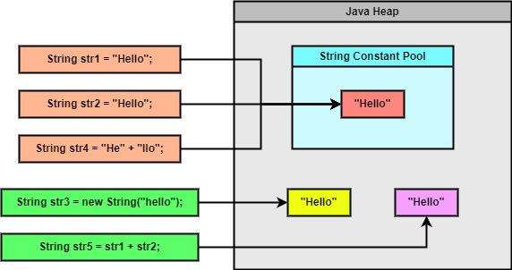

### Chapter 15 : String

- [`5. String 의 내용을 비교하고 검색하는 메서드들도 있어요`](#5-string-의-내용을-비교하고-검색하는-메서드들도-있어요)
- [`6. String 내에서 위치를 찾아내는 방법은 여러 가지에요`](#6-string-내에서-위치를-찾아내는-방법은-여러-가지에요)

---

### `5. String 의 내용을 비교하고 검색하는 메서드들도 있어요`

`C++`, `Python` 과 마찬가지로 `String` 클래스에는 문자열 비교, 검색 등을 위한 메서드가 존재한다.

교재의 해당 절에서는 다음 4 가지의 유형의 메서드를 설명한다.

- [`A. 문자열의 길이를 확인하는 메서드`](#a--b--length-isempty)
- [`B. 문자열이 비어 있는지 확인하는 메서드`](#a--b--length-isempty)
- [`C. 문자열이 같은지 비교하는 메서드`](#c-문자열이-같은지-비교하는-메서드)
- [`D. 특정 조건에 맞는 문자열이 있는지 확인하는 메서드`](#d-특정-조건에-맞는-문자열이-있는지-확인하는-메서드)

---

#### `A & B : length, isEmpty`

문자열의 길이를 확인하는 메서드는 `length()` 메서드이며, 비어있는지 확인하는 메서드는 `isEmpty()` 이다.

|`Method`|`Description`|
|---|---|
|`int length()`|문자열의 길이를 반환한다. 이 때 길이란 문자열을 유니코드 단위로 나눴을 때 그 개수를 의미한다.|
|`boolean isEmpty()`|`length()` 가 `0` 일 때 `true`, 그렇지 않으면 `false` 를 반환한다.|

덧붙여 두 메서드 모두 `CharSequence` `interface` 에 추상 메서드로 속해있다 한다.


---

#### `C. 문자열이 같은지 비교하는 메서드`

`String` 의 메서드 중 문자열이 같은지 비교하는 메서드들은 다음과 같은게 있다.

|`Method`|`Description`|
|---|---|
|`boolean equals(Object anObject)`|`java.lang.Object` 의 `equals` 를 `Override` 한 메서드이다. `Object` 의 그것과 동일하다.|
|`boolean equalsIgnoreCase(String anotherString)`|주어진 문자열과 현재 문자열을 대소문자 상관없이 비교한다. 만약 두 문자열이 동일한 객체이거나 `(current == given)` 대소문자 상관없이 동일하다면 `(길이 포함)` `true` 를 반환한다.|
|`int compareTo(String anotherString)`|주어진 문자열과 현재 문자열을 `"사전순"` `(lexicographically)` 으로 비교한 차이를 반환한다.. 현재 `String` 이 주어진 것보다 사전적으로 `선행` `(precedes)` 하면 `음수`, 동일하면 `0`, `후행` `(follows)` 하면 `양수` 를 반환한다.|
|`int compareToIgnoreCase(String str)`|`compareTo(String anotherString)` 와 동일한 과정을 대소문자 상관없이 진행한다.|
|`boolean contentEquals(CharSequence cs)`|문자열과 주어진 `CharSequence` 와 동일한지 확인한다. 문자열과 주어진 `CharSequence` 가 동일한 순서의 문자를 가져야만 `true` 를 반환한다. 만약 `CharSequence` 가 `StringBuffer` 로 주어진다면 해당 메서드는 `"동기화"` `(스레드 동기화?)` 된다. `(CharSequence 는 interface, StringBuffer 는 이를 implements 한 클래스이다)`|
|`boolean contentEquals(StringBuffer sb)`|`contentEquals(CharSequence cs)` 메서드에 `StringBuffer` 가 주어진 것과 동일하다.|

`equals` 메서드에서 연산자 `==` 에 관한 언급이 나왔다. 이에 관한 자세한 설명은 [`(CH 12.4 - 비교 연산자 == 와 equals 메서드의 차이)`](../ch_12/section_01_04.md#4-객체는--만으로-같은지-확인이-안-되므로-equals-를-사용하죠) 를 참조하는 것이 좋을 듯 하다.


`Java` 는 리터럴 문자열을 저장하는 영역인 `String Constant Pool` 또는 `String Pool` 이 존재한다.  교재에는 `Constant Pool` 이라고 나오지만 이는 `Runtime Constant Pool` 과 헷갈릴 오해가 있다. [`[1]`](#1--java-많이-헷갈려하는-string-constant-pool과-runtime-constant-pool-class-file-constant-pool---deverics-tistory)

`String Pool` 은 `JVM Memory` 의 `Heap` 에 존재하고 `(JDK 7 부터 Heap 으로 변경)` **일반적**으로 `GC` 의 대상이 되지는 않는다. `Java` 는 같은 값을 가진 문자열이 `String Pool` 에 존재하는지 확인하고, 만약 존재한다면 그 문자열을 참조해 **재사용**한다.

다음과 같은 상황을 보자.

```java
String str1 = "Hello";
String str2 = "Hello";
String str3 = new String("Hello");

String str4 = "He" + "llo";         // equivalent with "Hello", done by compiler
String str5 = str1 + str2;          // equivalent with new StringBuilder(str1).append(str2).toString(), done by compiler [2]


System.out.println(str1 == str2);   // true
System.out.println(str1 == str3);   // false
System.out.println(str1 == str4);   // true
System.out.println(str1 == str5);   // false
```

`String Pool` 에 저장되는 대상은 크게 리터럴 문자열, `intern()` 메서드를 이용해 생성된 문자열 뿐이다. `(intern() 메서드는 추후에 설명한다)`

또한 `str3` 의 경우 `compiler` 에 의해 `"He" + "llo"` 는 `"Hello"` 로 그냥 변환된다. 따라서 `String Pool` 에는 `"Hello"` 가 저장되며, 이는 `str1`, `str2`, `str3` 와 동일하다.

또한 `str5` 의 경우 `compiler` 에 의해 `str1 + str` 가 `new StringBuilder(str1).append(str2).toString()` 로 변환된다 한다. [`[2]`](#string-concatenation-concat-vs--operator---stackoverflow) 때문에 `str5` 는 새로운 객체가 생성되는 것이므로, `String Pool` 의 `"Hello"` 를 가르키지 않는다.

앞서 말할 설명을 그림으로 나타내면 다음과 같다.

<p align="center">
    
</p>


`compareTo` 메서드는 주어진 문자열의 `"사전순서에 따른 차이"` 를 반환한다.

```java
String str1 = "aABCDEFG";
String str2 = "bABCAA";

System.out.println(str1.compareTo(str2));       // -1
```

사전순으로 `aABCDEFG` 는 `bABCAA` 보다 한글자 앞에 있다. `a` 가 `b` 보다 알파벳 순서로 하나 앞에 있기 때문이다.
그래서 위 코드를 확인하면 `-1` 이 반환됨을 확인할 수 있다.

마지막으로 `contentEquals` 메서드의 경우 교재에서 조금 이따 다른 절에서 알아본다 한다.

---

#### `D. 특정 조건에 맞는 문자열이 있는지 확인하는 메서드`

|`Method`|`Description`|
|---|---|
|`boolean startsWith(String prefix)`|문자열이 주어진 문자열로 시작하는지 확인한다.|
|`boolean startsWith(String prefix, int toffset)`|문자열의 지정된 `offset` 에서 주어진 문자열로 시작하는지 확인한다.|
|`boolean endsWith(String suffix)`|문자열이 주어진 문자열로 끝나는지 확인한다.|
|`boolean contains(CharSequence s)`|현재 문자열에 주어진 `CharSequence` 가 존재하는지 확인한다.|
|`boolean matches(String regex)`|문자열이 주어진 `정규 표현식` 과 일치하는지 확인한다. `(정규 표현식은 java.util.regx 패키지의 Pattern 클래스를 참조)` |
|`boolean regionMatches(boolean ignoreCase, int toffset, String other, int ooffset, int len)`|문자열의 특정 영역이 주어진 문자열과 대소문자를 구분하지 않고 동일한지 확인한다.|
|`boolean regionMatches(int toffset, String other, int ooffset, int len)`|대소문자를 구별해 `regionMatches` 메서드를 실행한다.|

이 중 `startsWith`, `regionMatches` 에서  `offset` 과 같은 매개변수를 볼 수 있다. `startsWith` 메서드의 경우 `offset` 이 음수인 경우 항상 `false` 를 반환하고, `regionMatches` 메서드는 다음과 같은 경우에 항상 `false` 를 반환한다.

- `toffset` 이 음수일 때
- `offset` 이 음수일 때
- `toffset + len` 이 현재 문자열 길이보다 클 때
- `offset + len` 이 주어진 문자열 길이보다 클 때

반면 다음과 같은 경우에는 항상 `true` 를 반환한다.

- `len` 이 음수일 때
- `ignoreCase = false` 이면서 현재 문자열과 주어진 문자열이 동일한 문자열일 때
- `ignoreCase = true` 이면서 대소문자 구분없이 두 문자열이 동일할 때

---

### `6. String 내에서 위치를 찾아내는 방법은 여러 가지에요`

`String` 의 메서드 중 특정 문자의 위치를 찾아내는 메서드는 다음과 같은 것들이 있다.

|`Method`|`Description`|
|---|---|
|`int indexOf(int ch)`|문자열에 주어진 문자 `(ch)` 가 첫번째로 나타나는 위치 `(index)` 를 반환한다. 만약 존재하지 않으면 `-1` 을 반환한다.|
|`int indexOf(int ch, int fromIndex)`|문자열의 특정 위치에서부터 주어진 문자 `(ch)` 가 첫번째로 나타나는 위치 `(index)` 를 반환한다. 특정 위치 앞 문자열은 무시된다. 만약 존재하지 않거나 `fromIndex` 가 문자열 길이보다 크다면 `-1` 을 반환한다. `fromIndex` 가 음수인 경우 `fromIndex=0` 과 동일한 효과를 낸다.|
|`int indexOf(String str)`|문자열에 주어진 문자열이 첫번째로 나타나는 위치를 반환한다.|
|`int indexOf(String str, int fromIndex)`|문자열의 특정 위치에서부터 주어진 문자열이 첫번째로 나타나는 위치를 반환한다.|
|`int lastIndexOf(int ch)`|문자열에 주어진 문자가 마지막으로 나타나는 위치를 반환한다.|
|`int lastIndexOf(int ch, int fromIndex)`|문자열에 주어진 문자가 마지막으로 나타나는 위치를 반환한다. 이 때, `fromIndex` 위치 부터 거꾸로 `(오른쪽에서 왼쪽으로)` 찾아나간다. `(fromIndex 뒤 문자열은 무시된다)`|
|`int lastIndexOf(String str)`|문자열에 주어진 문자열이 마지막으로 나타나는 위치를 반환한다.|
|`int lastIndexOf(String str, int fromIndex)`|문자열의 특정 위치 이진에 주어진 문자열이 마지막으로 나타나는 위치를 반환한다.|

중복되는 내용이 많다. 그냥 `Python` `str` 의 `index` 메서드랑 동일하다 생각하면 된다.


---

### Reference

- ##### [`[1] : [Java] 많이 헷갈려하는 String constant pool과 Runtime Constant pool, Class file constant pool - DevEric's tistory`](https://deveric.tistory.com/123)

- ##### [`String concatenation: concat() vs "+" operator - StackOverflow`](https://stackoverflow.com/questions/47605/string-concatenation-concat-vs-operator)
    - `[2]` : Niyaz is correct, but it's also worth noting that the special + operator can be converted into something more efficient by the Java compiler. Java has a StringBuilder class which represents a non-thread-safe, mutable String. When performing a bunch of String concatenations, the Java compiler silently converts `String a = b + c + d;` into `String a = new StringBuilder(b).append(c).append(d).toString();` which for large strings is significantly more efficient.