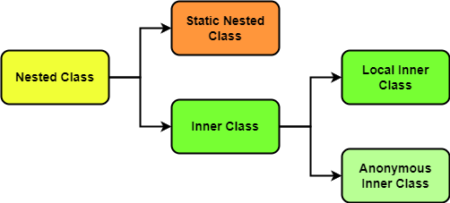
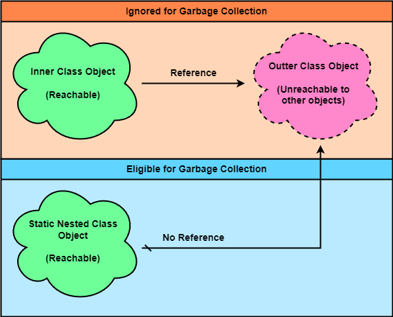

### Chapter 16 : 클래스 안에 클래스가 들어갈 수도 있구나

- [`1. 클래스 안의 클래스`](#1-클래스-안의-클래스)
- [`2. static nested 클래스의 특징`](#2-static-nested-클래스의-특징s)
- [`3. 내부 클래스와 익명 클래스`](#3-내부-클래스와-익명-클래스)
- [`4. Nested 클래스의 특징은 꼭 알아야 한다`](#4-nested-클래스의-특징은-꼭-알아야-한다)

---

### `1. 클래스 안의 클래스`

`Java` 에도 클래스 안에 클래스가 들어갈 수 있다. 이러한 클래스를 `"Nested Class"` 라 부른다. `Nested Class` 선언 방식에 따라 `Static Nested Class`, `Inner Class` 로 나눌 수 있다. `Inner Class` 는 말 그대로 클래스 속에 정의된 클래스이고, `Static Nested Class` 는 이를 정적으로 정의한 클래스이다.

`Nested Class` 형태를 사용하는 가장 큰 이유는 코드를 간단히 표현하기 위함이다.
- 역할에 따라 클래스를 모아두어 코드가 보기 편함 `(Static Nested Class)`
- 캡슐화를 이용해 좀 더 안전한 코드를 만들 수 있음 `(Inner Class)`
- 이를 통해 코드의 가독성과 유지보수성을 높임

`Java` 에서 `Nested Class` 는 대개 `Java` 기반의 `UI` 를 처리할 때, 사용자의 입력이나 외부 이벤트에 대한 처리를 할 때 사용된다.

`Inner Class` 는 또 2 가지로 나눌 수 있는데, `Local Inner Class`, `Anonymous Inner Class` 이다.

<p align="center">
    
</p>

`Nested Class` 는 쉽게말해 `"Outer Class 를 어느정도 사용할 수 있는 package"` 라 할 수 있다.

다음 예시를 보자.

```java
class OuterClass {
    public int OuterValue = 10;
    public InnerClass inner = new InnerClass();
    
    class InnerClass {
        public int InnerValue;

        public void innerMethod() {
            System.out.println("can access to OuterValue\t: " + OuterValue);
        }
    }

    public void outerMethod() {
        System.out.println("OuterClass can not access to InnerValue");
        System.out.print("But InnerClass ");
        inner.innerMethod();
    }
}

OuterClass outerClass = new OuterClass();
OuterClass.InnerClass innerClass = outerClass.new InnerClass();

outerClass.OuterValue = 5;
outerClass.outerMethod();     System.out.println();

innerClass.innerMethod();       System.out.println();

System.out.println("hashCode\tidentityHashCode");
System.out.println(
    String.format("0x%8x", outerClass.inner.hashCode()) + "\t" + 
    String.format("0x%8x", System.identityHashCode(outerClass.inner))
);
System.out.println(
    String.format("0x%8x", innerClass.hashCode()) + "\t" + 
    String.format("0x%8x", System.identityHashCode(innerClass))
);
```
```
OuterClass can not access to InnerValue
But InnerClass can access to OuterValue        : 5

can access to OuterValue       : 5

hashCode        identityHashCode
0x2f2c9b19      0x2f2c9b19
0x7cca494b      0x7cca494b
```

`InnerClass` 에서는 `OuterClass` 의 필드에 접근할 수 있다. 반면 `OuterClass` 에서는 `InnerClass` 의 필드에 접근할 수 없다.

`innerClass` 객체는 `outerClass` 로 인해 생성되었으므로, `OuterValue` 의 참조가 유지된다. 그래서 `OuterValue` 가 `5` 로 바뀌었음에도 그대로 유지됨을 볼 수 있다.

`(OuterValue 의 참조만 유지될 뿐, outerClass.inner 인스턴스와 innerClass 객체가 동일하다는 것은 아니다)`

---

### `2. static nested 클래스의 특징`

`Static Nested Class` 는 `static` 키워드를 이용해 정의한 `Inner Class` 이다.

하지만 이로 인해 시스템 성능에 큰 차이를 이끌 수 있는데, `Outer Class` 가 `GC` 에 의해 수거될 수도 있고 아닐 수 있기 때문이다.

일반적으로 `Java` 의 `GC` 는 어느 객체가 `"닿을 수 없는"` `(Unreachable)`, 즉 객체가 어디에서도 참조되지 않을 때 `어느순간` 해당 객체가 존재하는 메모리를 청소한다.

<p align="center">
    
</p>

그런데 `Inner Class` 는 항상 어느 `Outer Class` **객체에 대한** 참조를 가지고 있다. 때문에 `Outer Class` **객체**가 다른 객체에 의한 참조가 없더라 해도, `Inner Class` 객체가 어딘가에서 `Reachable` 한 이상 `GC` 에 의해 수거되지 않는다. `(Inner Class, Outer Class 모두 Unreachable 해야 수거된다)`

반면 `Static Nested Class` 의 경우 `Outer Class` **객체**의 참조를 가지고 있지 않다. 따라서 `Inner Class` 의 경우와 다르게 `GC` 의 수거대상에 올라간다.

또한 `Static Nested Class` 는 `"Outer Class 에 대한 static 한 참조를 가질 뿐, static 하지 않은"` 점에 유의해야 한다.

```java
class OuterClassStatic {
    public static int OuterValueStatic = 15;
    public InnerClassStatc inner = new InnerClassStatc();
    
    static class InnerClassStatc {
        public int InnerValue;

        public void innerMethod() {
            System.out.println("can only access to OuterValueStatic\t: " + OuterValueStatic);
        }
    }

    public void outerMethod() {
        System.out.println("OuterClassStatic can not access to InnerValue");
        System.out.print("But InnerClassStatc ");
        inner.innerMethod();
    }
}

OuterClassStatic outerClassStatic = new OuterClassStatic();
OuterClassStatic.InnerClassStatc innerClassStatc = new OuterClassStatic.InnerClassStatc();

OuterClassStatic.OuterValueStatic = 10;
outerClassStatic.outerMethod();     System.out.println();

innerClassStatc.innerMethod();       System.out.println();

System.out.println("hashCode\tidentityHashCode");
System.out.println(
    String.format("0x%8x", outerClassStatic.inner.hashCode()) + "\t" + 
    String.format("0x%8x", System.identityHashCode(outerClassStatic.inner))
);
System.out.println(
    String.format("0x%8x", innerClassStatc.hashCode()) + "\t" + 
    String.format("0x%8x", System.identityHashCode(innerClassStatc))
);
```
```
OuterClassStatic can not access to InnerValue
But InnerClassStatc can only access to OuterValueStatic        : 10

can only access to OuterValueStatic    : 10

hashCode        identityHashCode
0x2f2c9b19      0x2f2c9b19
0x7cca494b      0x7cca494b
```

만약 `OuterClassStatic.InnerClassStatc` 클래스가 여타 `static` 필드와 같았다면, `outerClassStatic.inner` 객체와 `innerClassStatc` 객체의 `identityHashCode` 가 동일해야 한다.

하지만 이 둘은 다르다. `OuterClassStatic.InnerClassStatc` **클래스** 는 `OuterClassStatic` **클래스** 에 대한 참조를 가지고 있을 뿐, 그저 <ins>**객체간 참조와 다르다는 것이다.**</ins>

`(OuterValueStatic 는 애초에 그냥 static 필드이므로 이를 공유하는 것은 당연하다)`

---

### `3. 내부 클래스와 익명 클래스`

#### `내부 클래스` `(Inner Class)`

앞서 [`1. 클래스 안의 클래스`](#1-클래스-안의-클래스) 에서 `Inner Class` 에 대한 예시를 보았다. `Inner Class` 객체를 생성하기 위해선 다음과 같이 만들 수 있다.

```java
class OuterClass {
    class InnerClass {}
}

OuterClass outer = new OuterClass();
OuterClass.InnerClass inner1 = outer.new InnerClass();
OuterClass.InnerClass inner2 = new OuterClass().new InnerClass();
```

위 문법에서 `Inner Class` 에 대한 특징을 잘 보여준다. `OuterClass` 타입 객체를 생성하지 않고는 `OuterClass.InnerClass` 타입 객체를 생성할 수 없기 때문이다.

때문에 이를 생성하기 위해선 `OuterClass` 타입 객체를 생성한 후 `outer.new InnerClass()`, `new OuterClass().new InnerClass()` 와 같이 생성할 수밖에 없다.

`익명 클래스` 의 경우, 교재에서 마음에 드는 정의가 없어 추가로 찾아봤다. 그 결과 `익명 내부 클래스` `(Anonymous Inner Class)` 와 `익명 클래스` `(Anonymous Class)` 가 비슷하면서도 다른 것을 확인하였다.

---

#### `익명 클래스` `(Anonymous Class)`

`익명 클래스` 는 `interface`, `추상 클래스` 등을 클래스 선언 없이 확장 `(extends)` 하거나 구현 `(implements)` 한 클래스이다.

```java
interface SomeInterface {
    default public void method1() {
        System.out.println("SomeInterface method1 origin");
    }
    public void method2();
}

abstract class SomeClass {
    public abstract void method1();
    public void method2() {
        System.out.println("SomeClass method2 origin");
    }
}

SomeInterface anonymousClass1 = new SomeInterface() {
    @Override
    public void method2() {
        System.out.println("SomeInterface method2 modified");
    }
};

SomeClass anonymousClass2 = new SomeClass() {
    @Override
    public void method1() {
        System.out.println("SomeClass method1 modified");
    }
};

anonymousClass1.method1();
anonymousClass1.method2();  System.out.println();
anonymousClass2.method1();
anonymousClass2.method2();
```
```
SomeInterface method1 origin
SomeInterface method2 modified

SomeClass method1 modified
SomeClass method2 origin
```

이전 `interface`, `추상 클래스` 에서는 이를 상속하여 새로운 클래스를 만들거나 하였다. 하지만 굳이 새로운 클래스를 만들지 않아고 특정 메서드만 `Override` 하면 되는 경우, 위처럼 `익명 클래스` 방법을 사용해 좀더 간결한 코드를 만들 수 있다.


---

#### `익명 내부 클래스` `(Anonymous Inner Class)`

`익명 내부 클래스` 는 위 `interface`, `추상 클래스` 등이 `Inner Class` 로 바뀐 것일 뿐이다.

```java
class OuterClass {
    class InnerClass {
        public void someInnerMethod() {
            System.out.println("Inner Method origin");
        }
    }

    public void someMethod(InnerClass input) {
        if (input.getClass() != InnerClass.class)   return;
        System.out.println("Outer Method origin");
    }
}

OuterClass outer = new OuterClass() {
    @Override
    public void someMethod(InnerClass input) {
        System.out.println("Outer Method modified");
    }
};
OuterClass.InnerClass anonymousInnerClass = new OuterClass().new InnerClass() {
    @Override
    public void someInnerMethod() {
        System.out.println("Inner Method modified");
    }
};

outer.someMethod(new OuterClass().new InnerClass());
anonymousInnerClass.someInnerMethod();
```

이전 `익명 클래스` 에서와 동일하게 어느 메서드를 `Override` 할 수 있다.


이처럼 `"뭔가를 만들어야 됐었는데 만들지 않거나, 객체를 숨기는 방식"` 이기 때문에 `익명` 이라는 단어가 붙은 것 같다.

---

### `4. Nested 클래스의 특징은 꼭 알아야 한다`

지금까지 클래스의 선언 방식에 따른 `Nested Class` 을 알아 보았다. 그러면서 잠시 `Nested Class` 에서 `Outer Class` 의 필드를 참조하는 것을 보았고, 그 반대는 할 수 없는 것을 보았다.

이를 제대로 알아보자.

---

#### `Static Nested Class 에서 참조 가능한 범위`

`Static Nested Class` 는 접근제한자에 상관 않고 `Outer Class` 의 `Static` 필드에만 접근할 수 있다. 이는 `Outer Class` 또한 마찬가지이다.

```java
class OuterClass {
    public String publicScope           = "publicScope";
    public static String pubStaticScope = "pubStaticScope";

    String packScope                = "packScope";
    static String packStaticScope   = "packStaticScope";

    protected String proScope               = "proScope";
    protected static String proStaticScope  = "proStaticScope";

    private String priScope                 = "priScope";
    private static String priStaticScope    = "priStaticScope";

    static class StaticNestedClass {
        public String publicInnerScope              = "publicInnerScope";
        public static String pubStaticInnerScope    = "pubStaticInnerScope";

        String packInnerScope               = "packInnerScope";
        static String packStaticInnerScope  = "packStaticInnerScope";

        protected String proInnerScope              = "proInnerScope";
        protected static String proStaticInnerScope = "proStaticInnerScope";

        private String priInnerScope                = "priInnerScope";
        private static String priStaticInnerScope   = "priStaticInnerScope";
        public void method() {
            System.out.println("StaticNestedClass can only access to static fields: ");
            System.out.println(pubStaticScope);
            System.out.println(packStaticScope);
            System.out.println(priStaticScope);
            System.out.println(proStaticScope);
            // System.out.println(publicScope);     compile error: non-static variable priScope cannot be referenced from a static context
            // System.out.println(packScope);
            // System.out.println(proScope);
            // System.out.println(priScope);
        }
    }

    public void method() {
        System.out.println("OuterClass can only access to static inner fields:");
        System.out.println(OuterClass.StaticNestedClass.pubStaticInnerScope);
        System.out.println(OuterClass.StaticNestedClass.packStaticInnerScope);
        System.out.println(OuterClass.StaticNestedClass.priStaticInnerScope);
        System.out.println(OuterClass.StaticNestedClass.proStaticInnerScope);
        // System.out.println(OuterClass.StaticNestedClass.publicInnerScope);  compile error: non-static variable publicInnerScope cannot be referenced from a static context
        // System.out.println(OuterClass.StaticNestedClass.packInnerScope);
        // System.out.println(OuterClass.StaticNestedClass.proInnerScope);
        // System.out.println(OuterClass.StaticNestedClass.priInnerScope);
    }
}

OuterClass outerClass = new OuterClass();
OuterClass.StaticNestedClass staticNestedClass = new OuterClass.StaticNestedClass();

staticNestedClass.method();     System.out.println();
outerClass.method();
```
```
StaticNestedClass can only access to static fields: 
pubStaticScope
packStaticScope
priStaticScope
proStaticScope

OuterClass can only access to static inner fields:
pubStaticInnerScope
packStaticInnerScope
priStaticInnerScope
proStaticInnerScope
```

만약 `non-static` 한 필드에 접근할 시, `static context` 에서 접근할 수 없다는 컴파일 에러를 뱉어낸다.

---

#### `Inner Class 에서 참조 가능한 범위`

반면 `Inner Class` 의 경우 많이 다른데, `Inner Class` 에서 `Outer Class` 의 필드를 접근하는데는 아무런 제한도 없지만, `Outer Class` 에서 `Inner Class` 의 경우 상당히 제한된다.

```java
class OuterClass {
    public String publicScope           = "publicScope";
    public static String pubStaticScope = "pubStaticScope";

    String packScope                = "packScope";
    static String packStaticScope   = "packStaticScope";

    protected String proScope               = "proScope";
    protected static String proStaticScope  = "proStaticScope";

    private String priScope                 = "priScope";
    private static String priStaticScope    = "priStaticScope";

    class InnerClass {
        public String publicInnerScope              = "publicInnerScope";
        public static String pubStaticInnerScope    = "pubStaticInnerScope";

        String packInnerScope               = "packInnerScope";
        static String packStaticInnerScope  = "packStaticInnerScope";

        protected String proInnerScope              = "proInnerScope";
        protected static String proStaticInnerScope = "proStaticInnerScope";

        private String priInnerScope                = "priInnerScope";
        private static String priStaticInnerScope   = "priStaticInnerScope";
        public void method() {
            System.out.println("InnerClass can access to every field: ");
            System.out.println(pubStaticScope);
            System.out.println(packStaticScope);
            System.out.println(priStaticScope);
            System.out.println(proStaticScope);
            System.out.println(publicScope);
            System.out.println(proScope);
            System.out.println(priScope);
        }
    }

    public void method() {
        System.out.println("OuterClass can only access to static inner field bypass:");
        System.out.println(OuterClass.InnerClass.pubStaticInnerScope);
        System.out.println(OuterClass.InnerClass.packStaticInnerScope);
        System.out.println(OuterClass.InnerClass.proStaticInnerScope);
        System.out.println(OuterClass.InnerClass.priStaticInnerScope);
    }
}

OuterClass outerClass = new OuterClass();
OuterClass.InnerClass innerClass = new OuterClass(). new InnerClass();

innerClass.method();    System.out.println();
outerClass.method();    System.out.println();

System.out.println("Outside of class, can not access to private-static field");
// System.out.println(OuterClass.InnerClass.priStaticInnerScope);   compile error: priStaticInnerScope has private access in OuterClass.InnerClass
```
```
InnerClass can access to every field: 
pubStaticScope
packStaticScope
priStaticScope
proStaticScope
publicScope
proScope
priScope

OuterClass can only access to static inner field bypass:
pubStaticInnerScope
packStaticInnerScope
proStaticInnerScope
priStaticInnerScope

Outside of class, can not access to private-static field
```

예시를 보면 `InnerClass` 에서는 모든 필드에 접근 가능하다. 하지만 `OuterClass` 에서는 어떠한 인스턴스 필드에 접근이 불가능하고 오직 `static` 필드만 접근 가능하다.

\+ 사실 위 `OuterClass` 에서 `InnerClass` 필드에 접근할 수 있는 방법이 하나 있다. 그리고 이는 `Static Nested Class` 의 경우에도 적용 가능하다.

```java
class OuterClass {
    public String var = "String origin";
    
    static class StaticNested {
        private String staticPrivate = "staticPrivate";
    }
    class Inner {
        private String innerPrivate = "innerPrivate";
        public void method() {
            System.out.println(var);
        }
    }

    public void method() {
        System.out.println("Actually, we can access(?) to those fields like this :");

        OuterClass.StaticNested staticNested = new OuterClass.StaticNested();
        OuterClass.Inner inner1 = new OuterClass(). new Inner();
        OuterClass.Inner inner2 = new Inner();

        System.out.println(staticNested.staticPrivate);
        System.out.println(inner1.innerPrivate);        System.out.println();

        inner1.method();
        inner2.method();
    }
}

OuterClass outerClass = new OuterClass();
outerClass.var = "String modified";

outerClass.method();
```
```
Actually, we can access(?) to those fields like this :
staticPrivate
innerPrivate

String origin
String modified
```

어찌 생각하면 좀 당연한 논리이다. 새롭게 생성한 객체기는 하지만 여전히 `OuterClass` 안에 있기 때문이다.

또한 여기서 한가지 새로운 사실을 알아내었는데, `inner1` 와 `inner2` 의 차이이다.

`inner1` 은 새로운 `OuterClass` 에서 파생된 `Inner` 객체이다. 반면 `inner2` 는 현재 메서드가 실행되고 있는 `OuterClass` 에서 파생된 객체이다.

때문에 `inner1.method()`, `inner2.method()` 를 비교해보면 서로 다름을 알 수 있다. `outerClass.method()` 를 호출하기 전, `outerClass.var` 의 값을 바꿔, `inner2` 가 참조하는 `var` 가 바뀌었기 때문이다.
